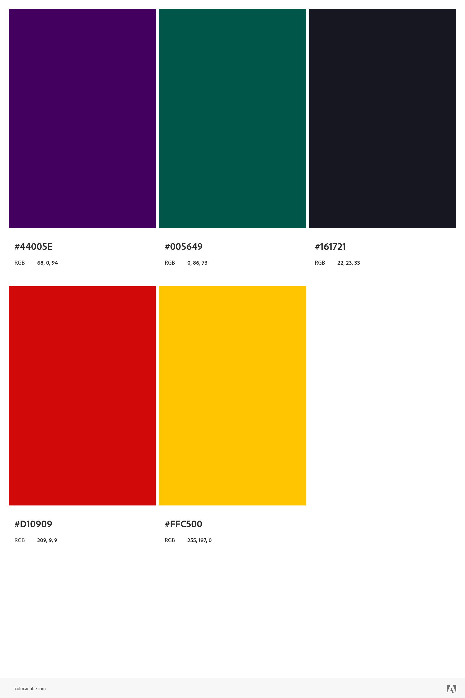

# Concept art e estilo visual

## Influencias
#### Influencias primarias (outros xogos)
__A principal influencia deste xogo, tamén na parte gráfica, é o xa mencionado *Disco Elysium*__. Moitos dos elementos formais deste traballo se basearán no mesmo, sendo algúns dos máis destacados a elección da **perspectiva isométrica e un estilo gráfico bastante pictórico**.

Outra referencia estilística sería o título __*Amnesia: the dark descent*, no referido ao uso de luces e sombres como elemento estructurador a nivel tanto narrativo como mecánico__.

#### Influencias secundarias (estilos artísticos)
Optaremos por tomar como referencias, sobre todo, aquelas obras de autores de cómic que escolleron narrativas e temáticas similares, cos que tamén __teremos en común o uso dun sombreado contrastado e dos xogos de luz e sombra para engadir dramatismo e focos de importancia nos elementos gráficos precisos__. Así pois, os autores principais referenciados serán __Charles Burns, Miguelanxo Prado e Alan Moore xunto con un dos debuxantes das súas obras, Jacen Burrows.__

## Estilo xeral

__A vista isométrica permitirá manter un estilo constante en diferentes escenarios, facilitando a coherencia estilística.__ A estética estará influenciada polos autores anteriormente mencionados, e pretenderá transmitir sensacións de **misterio, cripticismo e inquietude**, acompañando así a mecánica principal ao redor do equilibro mental.

Para isto optamos por utilizar **sombreados negros e moi contrastados**, así como unha **iluminación escasa e enfocada a elementos concretos** (aqueles que sexan necesarios para a xogabilidade ou a narrativa).

#### Paleta de cores
As cores principais, a parte dos negros, serán aquelas que forman parte dos violetas escuros, en contraste co verde como cor complementaria, e parte da gama cálida para engadir contraste e elementos luminosos:

## Personaxes principais
Os personaxes terán, principalmente, dúas vistas:
* __A primeira vista será un debuxo estático que os representará nos menús contextuais e nas cinemáticas.__ Manterá unha estética máis coidada donde se detallarán, de xeito moi xeral, as emocións dos personaxes xogables.
* __A segunda será a vista isométrica que formará parte do mundo do xogo.__ Será unha visión máis simplificada para poder aforrar recursos, ainda que deberá ser posible o cambio da roupa do personaxe según o seu inventario

## Escenario e elementos contextuais
__A carga gráfica deste xogo ubicarase nos escenarios__ xa que, por optimización e tendo en conta a estética, é donde se se poden representar, con maior facilidade e efectividade, os valores descritos no apartado de estilo xeral. Así mesmo, __os elementos contextuais deberán ser sinxelos e ocupar a menor cantidade de espazo posible na pantalla__, de xeito que non se descontextualice demasiado a exeperiencia narrativa.

